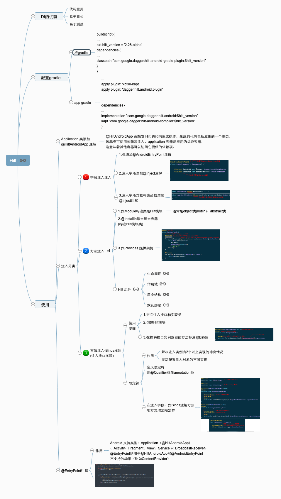

## [Hilt](https://developer.android.com/codelabs/android-hilt#0)
- DI的优势:代码重用、易于重构、易于测试
- 配置gradle
    - 根gradle
    ```gradle
    buildscript {
        //...
        ext.hilt_version = '2.28-alpha'
        dependencies {
            //...
            classpath "com.google.dagger:hilt-android-gradle-plugin:$hilt_version"
        }
    }
    ```
    - app gradle
    ```gradle
    //...
    apply plugin: 'kotlin-kapt'
    apply plugin: 'dagger.hilt.android.plugin'

    //...
    dependencies {
        //...
        implementation "com.google.dagger:hilt-android:$hilt_version"
        kapt "com.google.dagger:hilt-android-compiler:$hilt_version"
    }
    ```
### 使用
- Application类添加`@HiltAndroidApp`注解
    - `@HiltAndroidApp` 会触发 Hilt 的代码生成操作。生成的代码包括应用的一个基类，该基类可使用依赖项注入。application 容器是应用的父级容器，这意味着其他容器可以访问它提供的依赖项。
- 注入分类
    - 1.字段注入.注入步骤
        - ①.类增加`@AndroidEntryPoint`注解
        - ②.注入字段增加`@Inject`注解
        ```kotlin
        @AndroidEntryPoint
        class LogsFragment : Fragment() {
            @Inject lateinit var logger: LoggerLocalDataSource
            @Inject lateinit var dateFormatter: DateFormatter
        }
        ```
        - ③.注入字段对象构造函数增加`@Inject`注解
        ```kotlin
        class DateFormatter @Inject constructor() { 
         }
        class LoggerLocalDataSource @Inject constructor(private val logDao: LogDao) {
        }
        ```

    - 2.方法注入(创建者模式提供的实例Hilt 模块提供注入实例对象)
        - 使用步骤
            - ①.`@Module`标注类是 Hilt模块(通常是object类(kotlin)、abstract类)
            - ②.`@InstallIn`指定绑定容器(标注Hilt模块类)
            - ③.`@Provides`提供实例
            ```kotlin
            @Module//①
            object DatabaseModule {
                @Provides//③：提供AppDatabase实例
                @Singleton//表示单例作用域Application
                fun provideDatabase(@ApplicationContext/*自动传递Application的context对象*/ appContext: Context): AppDatabase {
                    return Room.databaseBuilder(appContext,  AppDatabase::class.java, "logging.db" ).build()
                }
                @Provides//③：提供LogDao实例
                fun provideLogDao(database: AppDatabase): LogDao {
                    return database.logDao()
                }
            }
            ```
        - [Hilt组件](https://developer.android.com/training/dependency-injection/hilt-android#generated-components)
            - [声明周期](https://developer.android.com/training/dependency-injection/hilt-android#component-lifetimes)
            - [作用域](https://developer.android.com/training/dependency-injection/hilt-android#component-scopes)
            - [层次结构](https://developer.android.com/training/dependency-injection/hilt-android#component-hierarchy)
            - [默认绑定](https://developer.android.com/training/dependency-injection/hilt-android#component-default)

    - 3.方法注入-Binds标注(注入接口实现)
        - 使用步骤
            - ①.定义注入接口和实现类
            - ②.创建Hilt模块
            - ③.在提供接口返回实例的方法中标注@Binds
            ```kotlin
            @InstallIn(ActivityComponent::class)//绑定容器Activity
            @Module
            abstract class NavigationModule {
                @Binds//介个方法返回的是AppNavigator接口
                abstract fun bindNavigator(impl: AppNavigatorImpl/*注入AppNavigator实现类*/): AppNavigator
            }
            ```
        - 限定符
            - 定义限定符用`@Qualifier`标注`annotation`类
            - 在注入字段、`@Binds`注解方法地方怎增加限定符
            ```kotlin
            //定义限定符
            @Qualifier annotation class InMemoryLogger
            @Qualifier  annotation class DatabaseLogger

            @InstallIn(ApplicationComponent::class)
            @Module
            abstract class LoggingDatabaseModule {
                @DatabaseLogger//使用限定符
                @Singleton
                @Binds
                abstract fun bindDatabaseLogger(impl: LoggerLocalDataSource): LoggerDataSource
            }

            @InstallIn(ActivityComponent::class)
            @Module
            abstract class LoggingInMemoryModule {
                @InMemoryLogger//使用限定符
                @ActivityScoped//作用域在Activity
                @Binds
                abstract fun bindInMemoryLogger(impl: LoggerInMemoryDataSource): LoggerDataSource
            }

            @AndroidEntryPoint
            class LogsFragment : Fragment() {
                @InMemoryLogger//使用InMemoryLogger限定符，注入LoggerInMemoryDataSource实例
                @Inject lateinit var logger: LoggerDataSource

            }
            ```
- @EntryPoint注解
    - 作用：Android 支持类型：Application（@HiltAndroidApp）、Activity、Fragment、View、Service 和 BroadcastReceiver。@EntryPoint则用于@HiltAndroidApp和@AndroidEntryPoint不支持的场景（比如ContentProvider）
    ```kotlin
    class LogsContentProvider: ContentProvider() {
        @InstallIn(ApplicationComponent::class)//必须。单例绑定Application
        @EntryPoint
        interface LogsContentProviderEntryPoint {
            fun logDao(): LogDao
        }
        private fun getLogDao(appContext: Context): LogDao {
            val hiltEntryPoint = EntryPointAccessors.fromApplication(//获取LogsContentProviderEntryPoint对象
                appContext,
                LogsContentProviderEntryPoint::class.java
            )
            return hiltEntryPoint.logDao()
        }
    }
    ```

- 整理自以前百度脑图笔记

