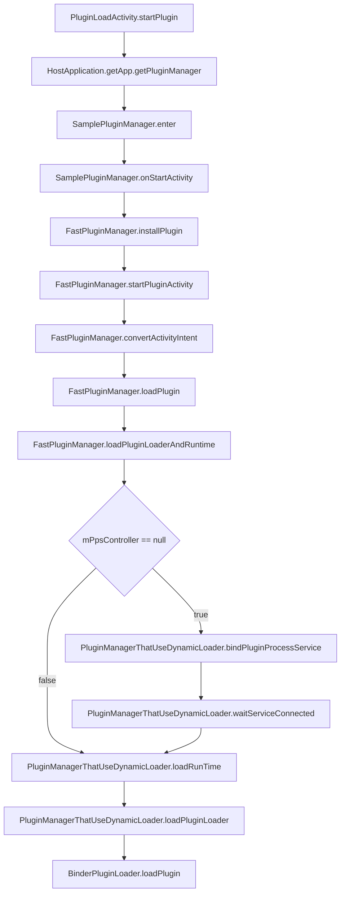

## shadow
### dynamic-host项目
- PluginProcessService:放到插件进程的Service。作用
    - 1.代表插件进程的生命周期。插件进程由它触发创建，由它负责自毁。
    - 2.接收反向注册进来的插件文件路径管理器（UuidManager，后续文章介绍插件包管理时再细讲），供Loader查找Manager安装好的插件文件路径。
    - 3.加载动态实现的Runtime和Loader。
    - 4.获取Loader的Binder接口。
    - 5.使插件中的Service能够跨进程工作。
- PpsBinder：Service端执行远程指令
- PPSController：Client端发送远程指令
- ImplLoader：通过`DexClassLoader`负责APK加载
- PluginManager:(`Manager`接口实现类`DynamicPluginManager`)负责插件的下载逻辑、入口逻辑，预加载逻辑等(一切还没有进入到Loader之前的所有事情)
```java
/**Manager的唯一方法，宿主中只会调用这个方法。传入当前界面的Context以便打开下一个插件Activity。
 * @param context context
 * @param formId  标识本次请求的来源位置，用于区分入口
 * @param bundle  插件中可能用到的参数
 * @param callback 用于从PluginManager实现中返回View
 */
void enter(Context context, long formId, Bundle bundle, EnterCallback callback);
```
- ShadowPluginLoader：负责插件加载（抽象类，loader工程需要继承这个模块eg.SamplePluginLoader）
	- 两个重要的函数
	```java
	 getHostActivityDelegate//:获取Host Activity代理
	 getHostContentProviderDelegate//:获取Host ContentProvider代理
	```
	- 怎么创建
		- 1.loader工程需要实现`CoreLoaderFactory`工厂（比如simple-loader中的CoreLoaderFactoryImpl）
		- 2.DynamicPluginLoader通过1中的工厂名称反射创建实例。

## 加载插件流程
