## 04.所有权
### [什么是所有权](https://kaisery.github.io/trpl-zh-cn/ch04-01-what-is-ownership.html)
- [Stack VS Heap](https://kaisery.github.io/trpl-zh-cn/ch04-01-what-is-ownership.html#%E6%A0%88stack%E4%B8%8E%E5%A0%86heap)_<font color="grey">（2023010)</font>_
    - Stack特性(3个)
        - 1.LIFO
        - 2.栈的数据大小已知道且固定
        - 3.入栈比在堆上分配内存快。(_因为在堆上分配内存需经过操作系统搜索空余内存，并返回空余内存指针。_)
        - 函数调用传递参数值和函数的局部变量被压入栈中。当函数结束时，这些值被移出栈。
            - _实际这跟cpu架构(X86)和语言函数调用规范相关联_
            ```asm
            Example1 PROC
                LOCAL temp:DWORD
                mov eax,temp
                ret
            Example1 ENDP

            push ebp
            mov ebp, esp			;栈指针
            add esp, OFFFFFFFCh     ;ESP 加 -4
            mov eax, [ebp-4]
            leave					;//等价mov esp,ebp; pop ebp 
            ret
            ```
            - _stdcall，cdecl，thiscall，fastcall，regparm(n)_
    - Heap特性(2个)
        - 1.存放编译时大小未知或大小变化的数据  
        - 2.访问Heap比访问Stack慢(_必须通过指针访问数据_)
        - 向Heap读写数据步骤
            - 写入数据
                - 1.在Heap上_分配内存（allocating on the heap）
                - 2.返回指针（分配内存的地址）
                - 3.拷贝数据到指针指向的内存
            - 读取数据
                - 1.通过指针指向Heap内存
                - 2.获取内存数据
- **[所有圈的规则](https://kaisery.github.io/trpl-zh-cn/ch04-01-what-is-ownership.html#%E6%89%80%E6%9C%89%E6%9D%83%E8%A7%84%E5%88%99)**
    - 1.**每个值都有一个所有者**
    - 2.**任意时刻，值有且只有一个所有者**
        ```rust
        //变量A 赋值给 变量B 情况：
        1.栈上数据类型（准确的是实现了Copy trait）,A、B可同时使用
        2.堆上数据类型，A的所有权转移给B，A不再可用
        ```
    - 3.**当所有者离开作用与，这个值被丢弃**
- [变量作用域](https://kaisery.github.io/trpl-zh-cn/ch04-01-what-is-ownership.html#%E5%8F%98%E9%87%8F%E4%BD%9C%E7%94%A8%E5%9F%9F)。_程序中一个变量的有效范围_
```rust
{// s 在这里无效, 它尚未声明
    let s = "hello";   // 从此处起，s 是有效的
    // 使用 s
} // 此作用域已结束，s 不再有效
```
- _[String类型](https://kaisery.github.io/trpl-zh-cn/ch04-01-what-is-ownership.html#string-%E7%B1%BB%E5%9E%8B)_
    - 字符串字面值
        - 代码手写的字符串值
        - 它们是不可变的：`编译时计算出所占大小、内容被硬编码到执行文件、执行速度快且高效`
    - String类型
        - 在Heap上分配内存
        - String类型在作用域结束后rust自动释放(drop)其申请的内存
            ```rust
            比如：
            {
            let s = String::from("hello"); // 从此处起,s是有效的
            //...
            } // 此作用域已结束,rust编译器自动插入调用drop
            ```
        - 创建String类型：  `let s=String::from("hahah");`

- **变量与数据的交互方式**
    - **[move(移动)](https://kaisery.github.io/trpl-zh-cn/ch04-01-what-is-ownership.html#%E5%8F%98%E9%87%8F%E4%B8%8E%E6%95%B0%E6%8D%AE%E4%BA%A4%E4%BA%92%E7%9A%84%E6%96%B9%E5%BC%8F%E4%B8%80%E7%A7%BB%E5%8A%A8)**
        - 1.栈上数据类型移动。`标量数据的移动发生copy动作(因为标量数据实现了Copy trait)`
            ```rust
            //比如：
            let x = 5;
            let y = x;//将5绑定到x；接着生成一个值x的拷贝并绑定到y(拷贝后仍然有效)
            ```
        - 2.堆上数据类型移动。
            - **拷贝堆数据类型的结构体,并没有复制指针指向的数据**
                - 比如String类型
                   - 它的组成部分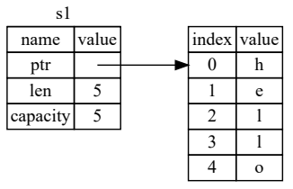
                    ```rust
                        // 1.左边(存储在栈上)
                        //  ptr:指向heap的指针
                        //  capacity:申请的heap的容量
                        //  len:当前字符串长度
                        //  2.右边：堆上申请的内存
                    ```
                    - 将String类型赋值给另外一个变量：**只复制结构体没有拷贝指针指向内存**
                    ```rust
                    let s1=String::from("hello");
                    let s2=s1;//s1赋值给s2的示意图如下
                    //有点类似：java的浅拷贝(shallow copy)
                    ```
                    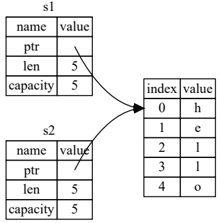
            - rust规避二次释放（double free）
                - 如上示意图所示：变量s1和s2同时指向一块heap,当s1和s2离开对应作用域都屌用drop函数，就存在出现两次释放的问题
                - 为了规避二次释放,rust规定 s1 赋值给s2后 s1即失效
                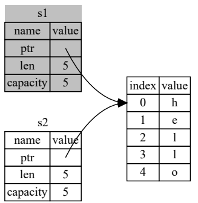
                ```rust
                 let s1 = String::from("hello");
                let s2 = s1;
                println!("{}, world!" , s1);//这里抛出错误 ：^^ value used here after move.
                ```
                > 符合所有权规则2：任意时刻，值有且只有一个所有者。所以赋值实际就是所有权的转移
                
    - clone和copy
        - [栈上数据的copy](https://kaisery.github.io/trpl-zh-cn/ch04-01-what-is-ownership.html#%E5%8F%AA%E5%9C%A8%E6%A0%88%E4%B8%8A%E7%9A%84%E6%95%B0%E6%8D%AE%E6%8B%B7%E8%B4%9D)
            ```rust
            let x = 5;
            let y = x;
            println!("x = {}, y = {}", x, y);//虽然y没有copy  x,但是x不会移动失效
            ```
            - **规则**
                - 1.**实现了 Copy trait注解的类型，从一个变量赋值给另外一个变量后仍然可用**
                - 2.**Copy trait和Drop trait互斥**._(Rust 不允许自身或其任何部分实现了 Drop trait 的类型使用 Copy trait)_
            
            - 实现了Copy trait的数据类型
                - 1.标量类型：所有整数、布尔、浮点数、字符串(char)
                    > 实际上都是拷贝成本基本可以忽略的数据类型。比如一个i32或u32在32cpu架构中不过是一条move指令

                - 2.元组。**当且仅当其包含的类型也都是 Copy trait的时候**。`比如， (i32, i32) 是 Copy 的，但(i32, String) 就不是。`
        - [堆上数据的clone](https://kaisery.github.io/trpl-zh-cn/ch04-01-what-is-ownership.html#%E5%8F%98%E9%87%8F%E4%B8%8E%E6%95%B0%E6%8D%AE%E4%BA%A4%E4%BA%92%E7%9A%84%E6%96%B9%E5%BC%8F%E4%BA%8C%E5%85%8B%E9%9A%86)
            ```rust
            let s1 = String::from("hello");
            let s2 = s1.clone();//clone 是通用函数
            println!("s1 = {}, s2 = {}", s1, s2);//s2复制了s1指向的堆内存，现在编译时不会报错了
            ```

- [所有权与函数(20230105)](https://kaisery.github.io/trpl-zh-cn/ch04-01-what-is-ownership.html#%E6%89%80%E6%9C%89%E6%9D%83%E4%B8%8E%E5%87%BD%E6%95%B0)
    - 函数调用参数传递
        - 将值传递给函数与给变量赋值的原理相似。

            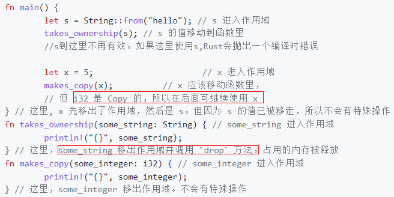
        - **向函数传递值可能会移动或者复制**
        
        
    - 返回值与作用域。**返回值也可以转移所有权**

        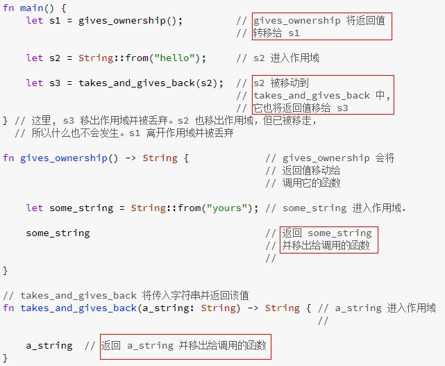

    - 变量的所有权遵循模式
        - 1.把一个值赋给其它变量时就会发生移动
        - 2.**当一个持有heap数据的变量离开作用域时，它的值就会被drop函数清理(除非数据的所有权移动到另外一个变量上)**

    - 如何避免函数使用值但不发生所有权转移
        - 1.函数用完变量后返回值返回变量
        - 2.下节的引用
### [引用与借用](https://kaisery.github.io/trpl-zh-cn/ch04-02-references-and-borrowing.html)
- 引用[20230105]
    - 允许你引用某个值而不取得其所有权
        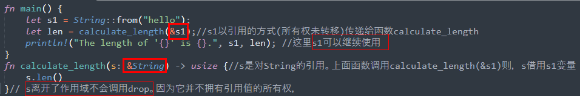

        引用示意图
        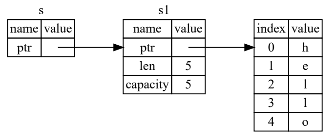

    - 引用的可变性和不可变性
        - 1.引用的不可变性：引用和变量一样默认是不可变的
            ```rust
            fn main() {
                let s = String::from("hello");
                change(&s);
            }
            fn change(some_string: &String) {
                some_string.push_str(", world");//cannot borrow `*some_string` as mutable, as it is behind a `&` reference
            }
            ```
        - 2.[可变引用](https://kaisery.github.io/trpl-zh-cn/ch04-02-references-and-borrowing.html#%E5%8F%AF%E5%8F%98%E5%BC%95%E7%94%A8)
            - 可变引用声明：**&mut**
                ```rust
                fn main() {
                    let s = String::from("hello");
                    change(&s);
                }
                fn change(some_string: &mut String) {
                    some_string.push_str(", world");//现在可正常编译了
                }
                ```

            - **可变引用的限制**
                - 在特定作用域内的变量只能有一个可变引用
                    ```rust
                    fn main() {
                        let mut s = String::from("hello");
                        let r1 = &mut s;
                        let r2 = &mut s;//cannot borrow `s` as mutable more than once at a time
                        println!("{}, {}", r1, r2);
                    }
                    ```

                    - 限制的作用：**编译期防止数据竞争(data race)**
                        - 两个以上的指针同时访问同一个数据
                        - 至少有一个指针用于写入数据
                        - 没有同步的机制访问数据
                - 可通过创建新作用域，实现非同时多个可变引用
                    ```rust
                    fn main() {
                        let mut s = String::from("hello");
                        {
                            let r1 = &mut s;
                        } // r1 在这里离开了作用域，所以我们完全可以创建一个新的引用
                        let r2 = &mut s;
                    }
                    ```

            - **一个变量不可同时拥有可变引用和不可变引用**
                ```rust
                //不可变引用的用户可不希望在他们的眼皮底下值就被意外的改变了！
                //然而，多个不可变引用是可以的，因为没有哪个只能读取数据的人有能力影响其他人读取到的数据。
                fn main() {
                    let mut s = String::from("hello");
                    let r1 = &s; // 没问题
                    let r2 = &s; // 没问题
                    let r3 = &mut s; //cannot borrow `s` as mutable because it is also borrowed as immutable

                    println!("{}, {}, and {}", r1, r2, r3);
                }
                ```


    - [悬垂引用(Dangling References)](https://kaisery.github.io/trpl-zh-cn/ch04-02-references-and-borrowing.html#%E6%82%AC%E5%9E%82%E5%BC%95%E7%94%A8dangling-references)
        - 悬垂指针是其指向的内存可能已经被分配给其它持有者
        - rust可避免悬空引用
        
            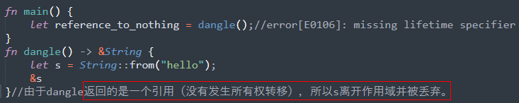
            > 当你拥有一些数据的引用，编译器确保数据不会在其引用之前离开作用域。

    - [读记引用的规则](https://kaisery.github.io/trpl-zh-cn/ch04-02-references-and-borrowing.html#%E5%BC%95%E7%94%A8%E7%9A%84%E8%A7%84%E5%88%99)
        - **在任意给定时间、作用域内，要么只有一个 可变引用，要么只有1个或多个不可变引用。**不允许同时 存在 可变和 不可变引用
        - 引用必须一直有效(指悬垂引用)

- 借用[20230105]
    - 将创建一个引用的行为称为 借用(borrowing)(如上：把引用作为函数参数这个行为叫借用)
### [Slice 类型](https://kaisery.github.io/trpl-zh-cn/ch04-03-slices.html)
- 定义[20230105]：提供一种不持有所有权的数据类型。(_本质还是指针。使用方式跟python的切片类似_)
- [字符串 slice(&str)](https://kaisery.github.io/trpl-zh-cn/ch04-03-slices.html#%E5%AD%97%E7%AC%A6%E4%B8%B2-slice)
    - 字符串切片是指向字符串中一部分内容的引用
        ```rust
        let s = String::from("hello world");
        let hello = &s[0..5];
        let world = &s[6..11];
        ```
        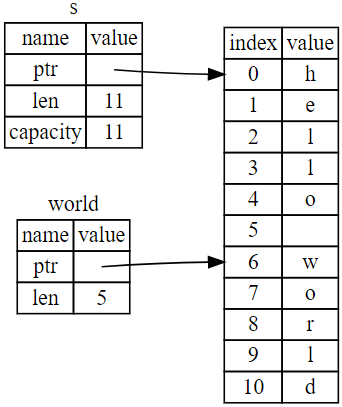
    
    - 语法形式
        - `[start..end]`
        - 语法糖
            - 1.`[0..end] => [...end]`
            - 2.`[satrt..s.len] => [...end]`
            - 3.`[0..s.len] => [...]`
    - 注意事项
        - 1.字符串切片的索引范围必须发生在有效的UTF-8字符边界内
        - 2.如果尝试从一个多字节字符的中间位置创建字符串 slice，程序将会因错误而退出
    
    - **字符串字面值就是slice**
        - 字符串字面值被直接存储在二进制程序中.```rust let s = "Hello, world!";```
        - &str 是一个不可变引用

            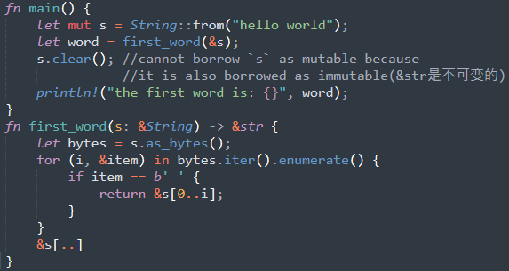
        - 将字符串切片作为**参数传递更具通用性**.(_String和&str都可以作为形参传递_)
        
            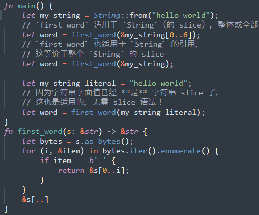
    - [其他类型的 slice(20230105)](https://kaisery.github.io/trpl-zh-cn/ch04-03-slices.html#%E5%85%B6%E4%BB%96%E7%B1%BB%E5%9E%8B%E7%9A%84-slice)
        ```rust
        let a = [1, 2, 3, 4, 5];
        let slice = &a[1..3];
        //这个 slice 的类型是 &[i32]。它跟字符串 slice 的工作方式一样，
        //通过存储第一个集合元素的引用和一个集合总长度
        ```

- 脑图

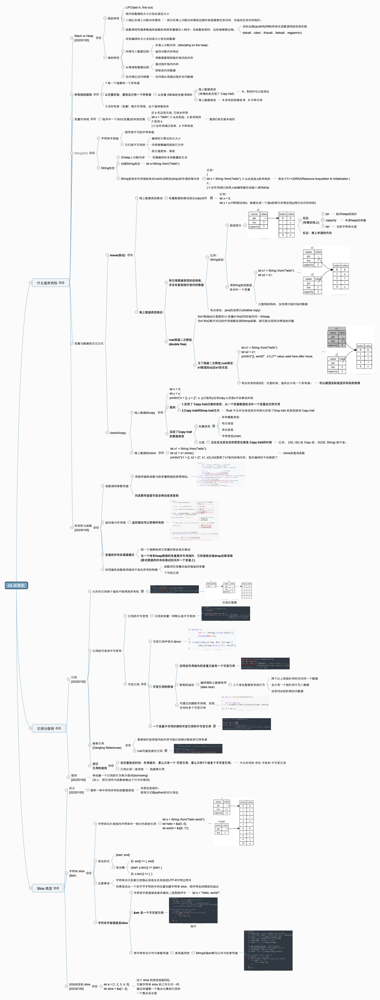